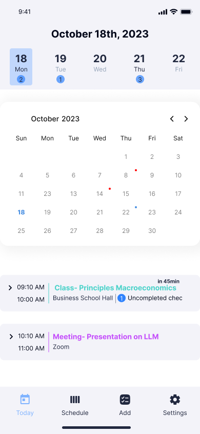
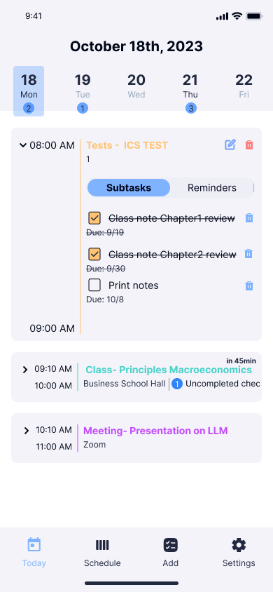
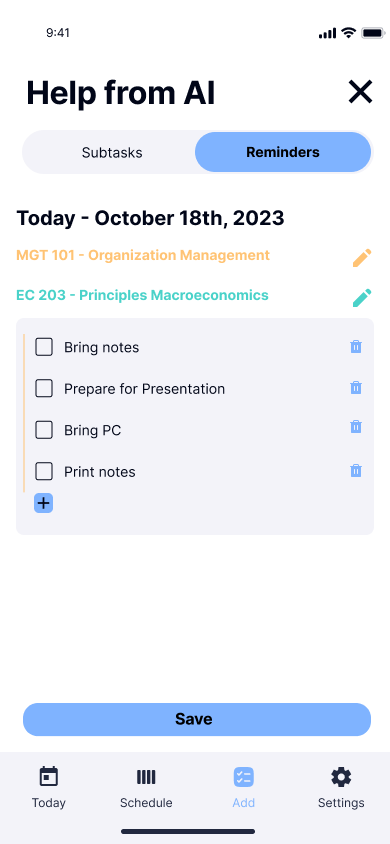
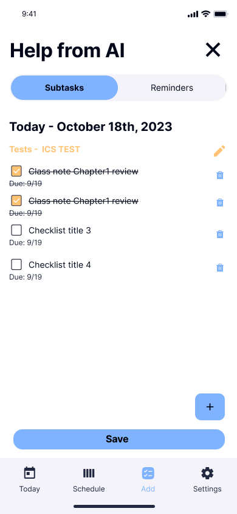
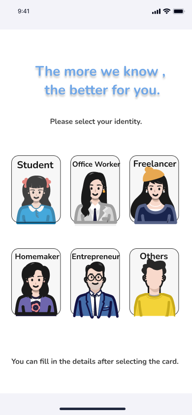
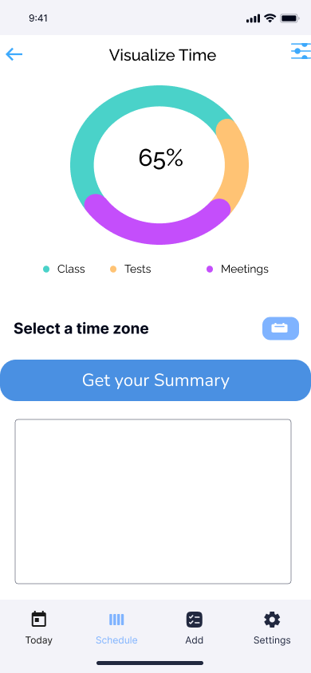

# TimeGenie

TimeGenie 是一个**AI 日程管理助手 APP**，旨在利用人工智能技术，帮助用户管理日程安排、生成日程事项与建议、建立用户画像以及知识库从而实现提供个性化的服务，提高生活效率和便利性。

## 界面预览

## 功能亮点

- 提供在线离线两种模式下的日程管理功能 根据网络状态自动切换 让用户在无感知的情况下自由使用 App 保证可用性
- 集成大模型 根据用户输入以及用户画像生成日程事项的建议 根据用户近期的日程数据生成总结与建议
- 集成 RAG 根据用户上传的文件形成个人的知识库 提供更为个性化的服务（完善中）

## 技术架构

- 界面设计：Figma 进行 UI 设计

- 前端：React Native 框架

  使用了[async-storage](https://github.com/react-native-async-storage/async-storage)实现日程数据的本地存储

  使用了[react-native-netinfo](https://github.com/react-native-netinfo/react-native-netinfo)实现网络状态监听

- 日程服务：Spring Cloud 框架 + [Nacos](https://github.com/alibaba/nacos)服务管理中心

  使用了 Spring Cache + [Redis](https://github.com/redis/redis)实现缓存技术

  使用了 Spring Session + [Redis](https://github.com/redis/redis)实现分布式服务下的 Session 共享存储

  使用 [spring-cloud-openfeign](https://github.com/spring-cloud/spring-cloud-openfeign)实现服务间调用以及负载均衡层

- AI 服务：FastAPI 框架 + [langchain](https://github.com/langchain-ai/langchain)

- 数据库：MySQL 关系型数据库

  进行分布式部署 并且配置主从复制以实现数据备份和宕机容灾

## 开始使用

TimeGenie 目前只经过了**安卓平台**的测试 安装包可在 Releases 处下载

\*目前租不起服务器 所以不支持在线功能 只能作为一款本地日程管理 App 使用 TT

## 贡献者(顺序不分先后)

- [Horizon12275](https://github.com/Horizon12275)
- [Sharkyesc](https://github.com/Sharkyesc)
- [JoyceQqi](https://github.com/JoyceQqi)
- [Seriousss](https://github.com/Seriousss)
- [关于 - nwdnysl](https://nwdnys1.github.io/about)
