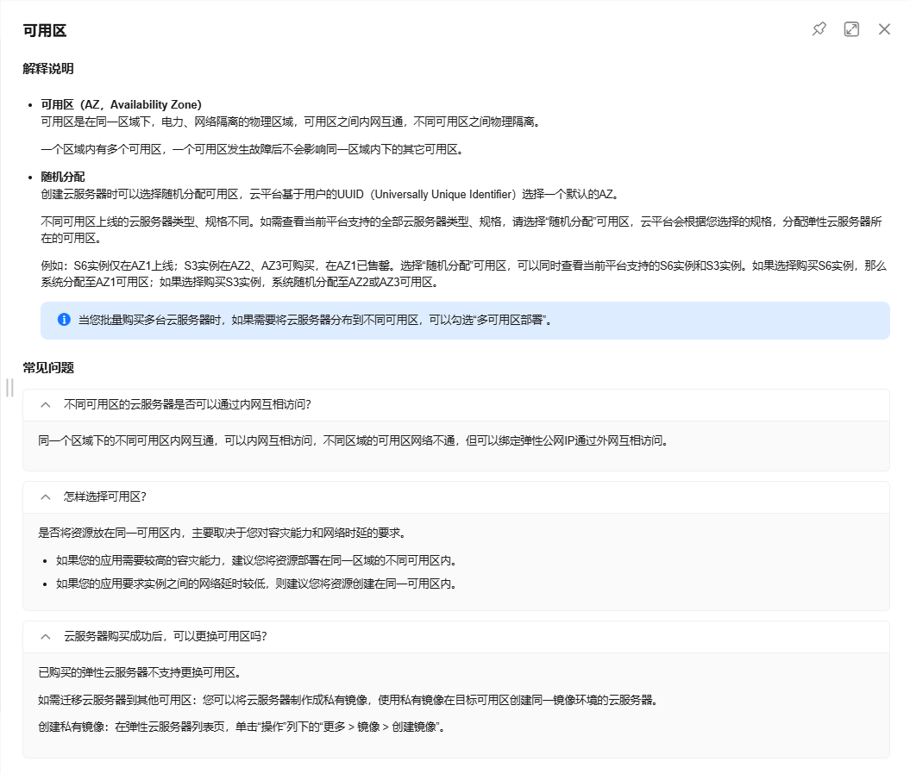
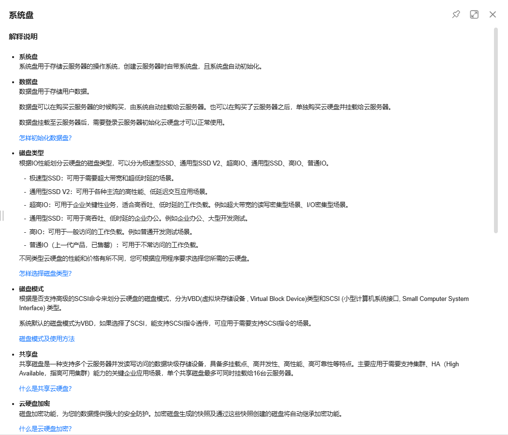
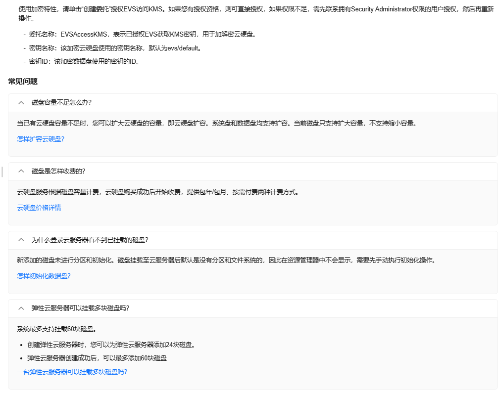
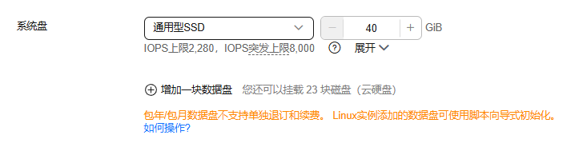
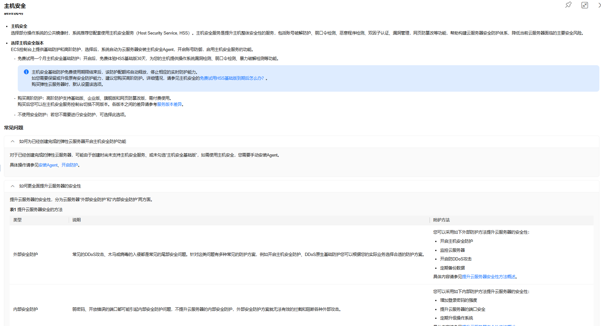
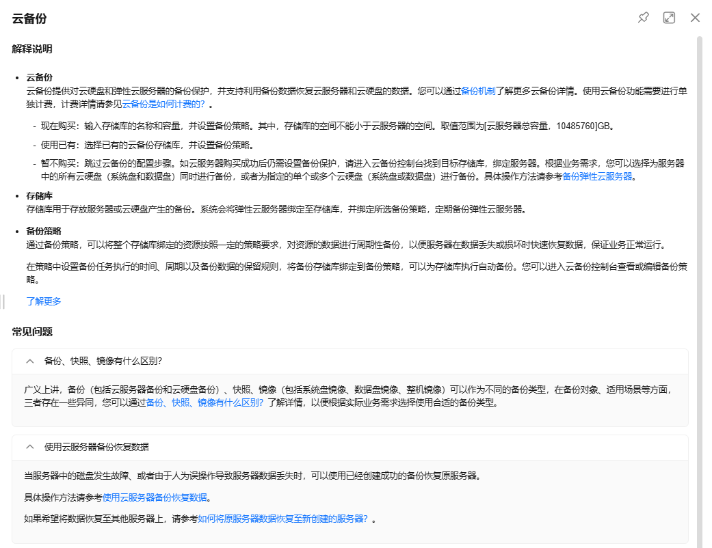
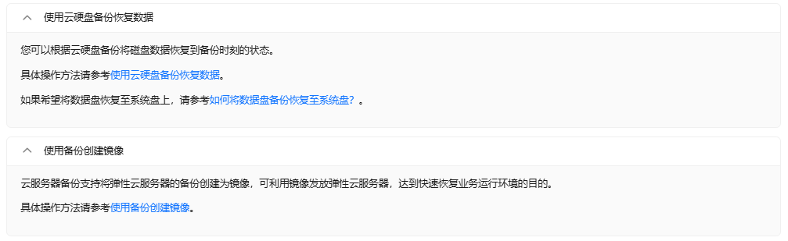
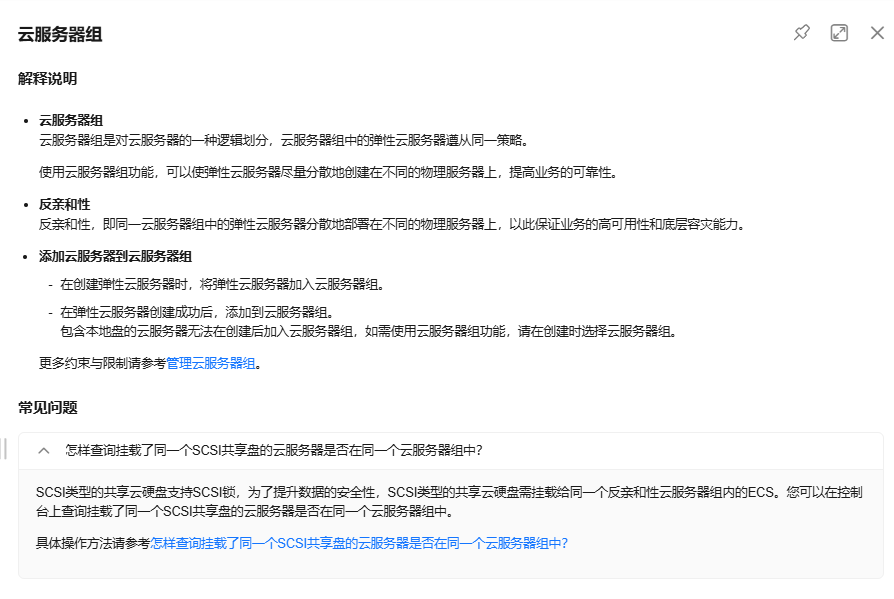
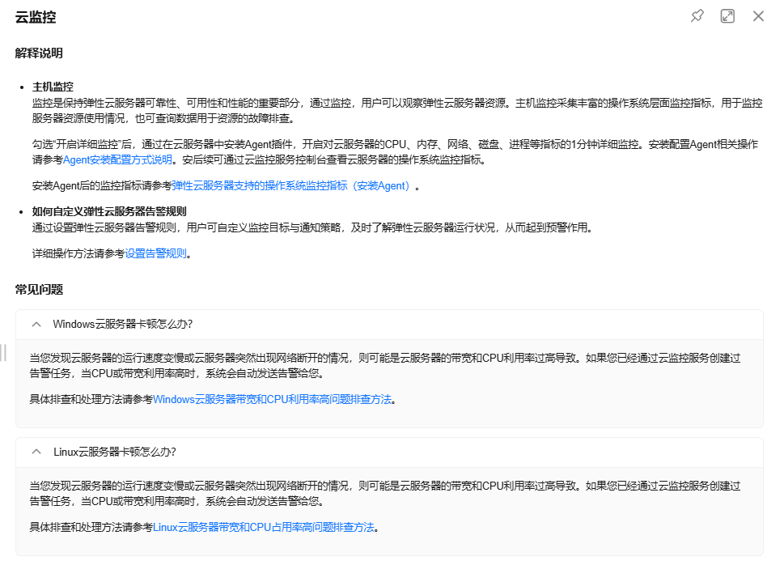

## 服务器选择

1. 目前服务器具体选型见文档点击连接https://inky-bamboo-9f2.notion.site/e3c126ca399643a1a94727c28a61cebc（区域：华东上海一，可用区一，规格：通用计算型s7 s7.large. 2vCPUs 4GiB，镜像：Ubuntu 22.04 server 64bit（40GiB））

2. 可用区的定义与选择：（目前选择可用区 1）

3. 系统盘的选择：（目前选择通用 SSD、40GiB）

4. 安全配置服务：（目前选择免费试用一个月）

5. 其余配置均与文档上相同

6. 云备份：暂不购买

7. 云服务器组的反亲和性配置：（目前放在了一个随机生成的云服务器组里）

8. 云服务器的监控设置：（目前能免费对 1 分钟内的详细信息进行监控）

9. 暂时先使用明文密码登录，后续可能会使用密钥登录易于管理密码（密码发在微信群里）

10. 安全组配置规则目前计划只对 sjtu 的 ip 开放、以保证安全性、后续设置完之后可能不在学校的时候需要连接 sjtu vpn 才能访问服务

11. 使用 mobaxterm 连接服务器的方法在另一份 old.md 文档里有详细说明

