# 阿里云运行前后端方法

## 1. 阿里云服务器的配置

### 1.1. 注册并使用阿里云服务器

有需求直接问我，在此不赘述。可以免费试用一个月。

### 1.2. 使用 mobaxterm 图形化界面利用 ssh 远程连接至服务器

mobaxterm 下载地址：https://mobaxterm.mobatek.net/download.html

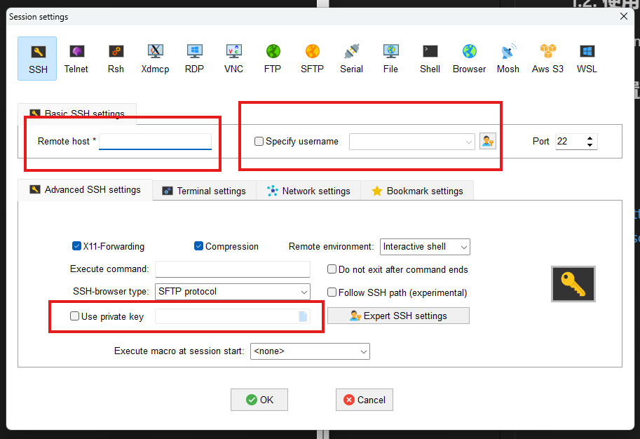

Remote Host: 101.132.129.104

Specify username: root

use private key:（这里没有用私钥 需要第一次进入之后手动输入密码然后连接）

连接完成如下所示，就是一个图形化的 ssh 连接助手，可以把文件拖到左边的菜单栏里，上传至服务器的对应路径下。右边就相当于虚拟机中 Linux 的命令行，可以执行 Linux 的各种操作。

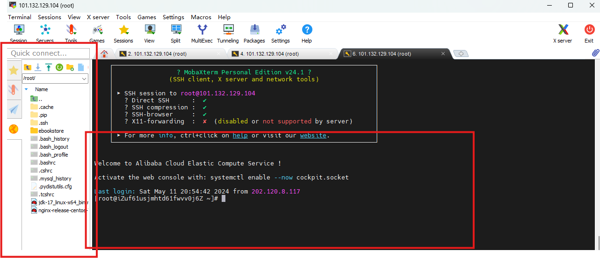

### 1.3. 配置环境（java，mysql，nginx，navicat）

有需求直接问我，在此不赘述。

其中，可以关注如何在本机使用 navicat 远程连接服务器上的 mysql 数据库，可以直观地显示，会更加清晰。

方法：

主机填写：101.132.129.104

用户名：root

密码：1111

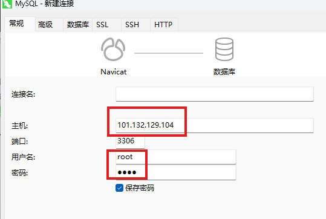

最终效果如下所示，和本地用 navicat 方法一样：

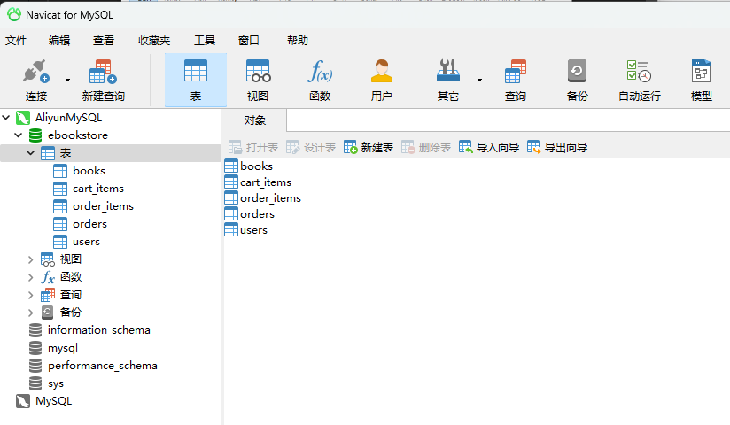

配置好了之后，就可以快速利用 navicat 导入 sql 文件，并创建新的数据库。如果要在命令行里导入 sql 文件也是一样的。

## 2. 如何使用服务器部署前后端

### 2.1. 部署前端 （nginx 运行 build 后的文件 index.html）

1. 在前端项目的控制台中输入 npm run build。目录下会出现一个 dist 文件夹。

2. 把这个 dist 文件夹放到一个你喜欢的路径里。

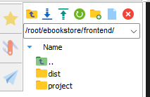

3. 在如下图所示的路径中配置对应的 nginx 文件（也可以新建，一个 server 对应一个监听端口，对应一份前端路径）。其中可配置项为，listen 为监听端口号，root 为你刚刚保存的 dist 的目录。下面几行是固定的转发配置，用于把前端的/api 开头的请求转发到后端。（101.132.129.104 就是我这个服务器的公网 ip 地址）

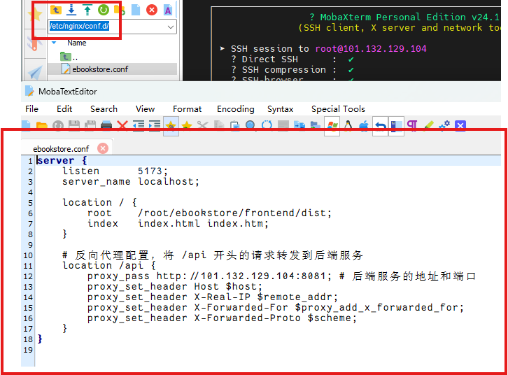

4. 最后在控制台里运行 nginx -s reload 命令，加载重启配置服务，在你的电脑里访问对应的路径就可以了。示例：http://101.132.129.104:5173/ 账号：1 密码：1

5. 【注意】前端在调用后端 api 的时候，要把 BASEURL 里的 localhost 换成服务器的 ip 地址（101.132.129.104），不然会报错。

6. "homepage":"." 要在 packagelock.json 里加上

7. （可能原因）如果没有 App.js 的话，用了 react-router，需要在 nginx 里多加一行 try_files $uri $uri/ /index.html;

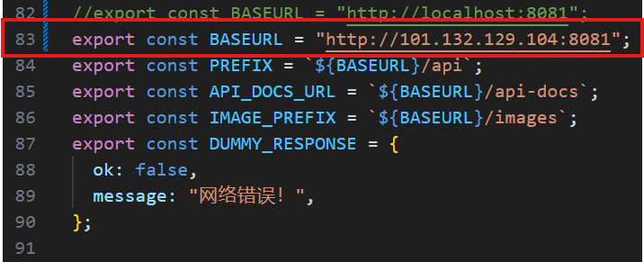

8. 具体配置流程前后不再赘述，有兴趣可以问我。

### 2.2. 部署后端 （用 maven 打包，让后端运行）

0. 一开始有一个细节，要在 pom.xml 里把对应的包的 skip 项删除，最终和我这个图里一样，就可以了。

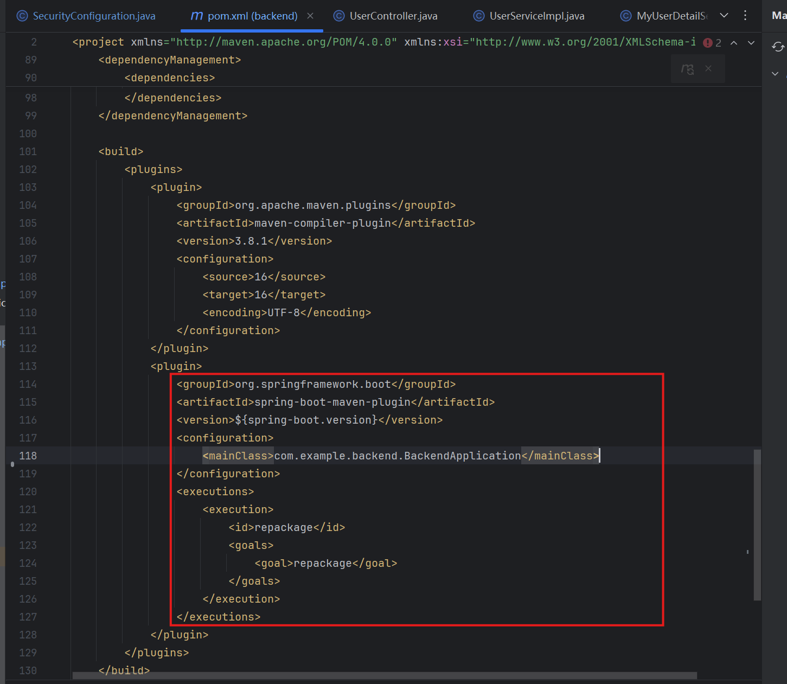

1. 点击 idea 右侧的 maven 命令，可以先 clean 之后，然后点 install 按钮，然后会在 target 路径下生成对应的 jar 包。最后把 jar 包拖到服务器的你喜欢的路径里。

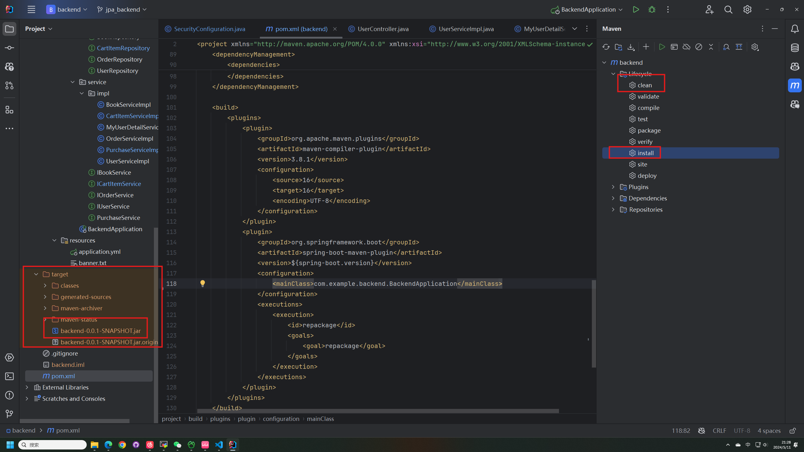

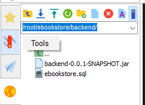

2. 切换到你后端项目的对应路径（cd 指令），然后输入指令 java -jar backend-0.0.1-SNAPSHOT.jar 就能开始临时运行后端程序了。（注意这种方法必须要在 mobaxterm 命令行开启的时候，后端才开启，命令行关闭之后，后端就关闭）。运行正常情况如下图所示。

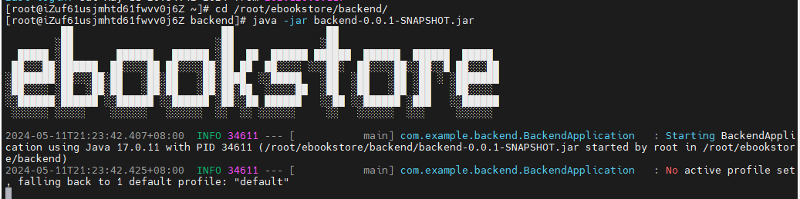

3. 持续运行后端的方法（不需要保持命令行打开）nohup java -jar backend-0.0.1-SNAPSHOT.jar >./log.txt 2>&1 &

### 2.3. 部署 peerServer 服务器

1. 服务器上安装 nodejs 和 pm2，执行指令：pm2 start index.js

2. 查看所有端口监听情况 netstat -lntp

3. 查看所有项目状态 pm2 list 查看日志 pm2 logs index 查看所有当前用 pm2 管理的项目 pm2 list

4. 查看 npm 全局安装过的所有包 npm list -g --depth 0

5. 记得要 npm install package.json 到对应的服务器目录里（pm2 执行之前）

6. 查看所有进程 ps ux

7. 杀死对应 id 的进程 kill -9 PID

## 3. 注意要点

1. 开放的端口需要配置，目前服务器只开放了 前端 5173,5174 端口 后端 8080,8081 端口，我可以手动增加开放的端口。

2. 配置远程数据库权限

进入 mysql 方法 : mysql -u root -p 密码 1111

查看用户表 SELECT host, user FROM mysql.user;

查看密码是否是 1111 use mysql; select User,authentication_string,Host from user;

-- 创建新用户并设置密码（如果用户不存在）
CREATE USER 'your_user'@'202.120.8.117' IDENTIFIED BY 'your_password';

-- 授予用户访问权限
GRANT ALL PRIVILEGES ON your_database.\* TO 'your_user'@'202.120.8.117';

-- 指定 ip 段访问
GRANT ALL PRIVILEGES ON your_database.\* TO 'your_user'@'202.120.8.%';

-- 刷新权限以使更改生效
FLUSH PRIVILEGES;
