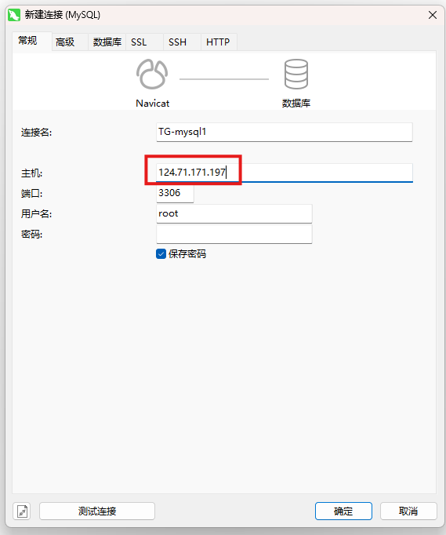

## 使用 docker 部署

1. 因为数据库不容易挂、所以也可以用容器进行部署、可能能方便后面 k8s 进行管理

2. docker pull mysql 拉取 mysql 镜像（这里默认是下载最新版本 9.0.0）

3. 指定下载版本 docker pull mysql:8.0.37

4. docker images 查看镜像

5. docker run --name TG-mysql1 -p 3306:3306 -v /home/mysql_data:/var/lib/mysql --restart=always -e MYSQL_ROOT_PASSWORD=YOUR_PASSWORD -d mysql:8.0.37

-p：容器的 3306 映射到主机的 3306 端口

-v：容器的/var/lib/mysql 目录挂载在主机的/home/mysql_data 目录

-e 设置默认参数，支持参数：

- MYSQL_ROOT_PASSWORD
- MYSQL_DATABASE
- MYSQL_USER, MYSQL_PASSWORD
- MYSQL_ALLOW_EMPTY_PASSWORD
- MYSQL_RANDOM_ROOT_PASSWORD
- MYSQL_ONETIME_PASSWORD

-d 后台运行，即使你关闭了终端或退出了 SSH 会话，容器也会继续在后台运行。

返回一长串字符，则说明创建成功。

5. docker ps -a 查看所有运行中容器

6. docker stop cbb-mysql1 停止容器

7. docker rm cbb-mysql1 删除容器

8. docker rmi mysql:latest 删除镜像

9. docker exec -it TG-mysql1 mysql -uroot -p 进入 mysql 输入密码之后进入 cli 界面

10. docker logs TG-mysql1 查看日志（检查什么原因报错）

11. 这里有一个报错原因是因为我之前一开始装了 9.0.0，然后没法强制降级、所以容器一直在重启、解决方法是把上面挂载的/home/mysql_data 目录删除、然后重新创建容器

12. 还有一个问题 就是因为我第二次初始化的时候误操作了 把密码设置成了 YOUR_PASSWORD 了，所以这也导致了我需要把/home/mysql_data 目录删除、然后重新创建容器

13. 查看用户表 SELECT host, user FROM mysql.user;

14. 创建新用户并设置密码，这里是为了远程用 navicat 控制数据库

    - 有线网 IP 段：
    - CREATE USER 'root'@'202.120.8.%' IDENTIFIED BY 'your_password';
    - 无线网 IP 段：
    - CREATE USER 'root'@'58.247.22.%' IDENTIFIED BY 'your_password';

15. -- 授予用户访问权限
    (下面的直接在 markdown 里面看是转义符的形式'\\\*'，实际上输入的时候需要只需要输入一个单独的星号即可)

    - 授予一个数据库的权限
    - GRANT ALL PRIVILEGES ON your_database.\* TO 'root'@'202.120.8.%';
    - GRANT ALL PRIVILEGES ON your_database.\* TO 'root'@'58.247.22.%';
    - 授予所有数据库的权限
    - GRANT ALL PRIVILEGES ON \*.\* TO 'root'@'202.120.8.%';
    - GRANT ALL PRIVILEGES ON \*.\* TO 'root'@'58.247.22.%';

16. -- 刷新权限以使更改生效

    - FLUSH PRIVILEGES;

17. 即可使用 navicat 在本地连接数据库

18. 查看连接池大小

    - show variables like 'max_connections';

## 直接安装 mysql

1. 感觉用 docker 挺方便的、先不直接安装 mysql 了
