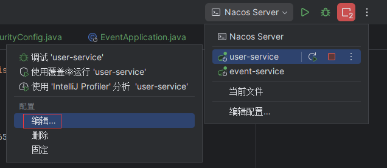
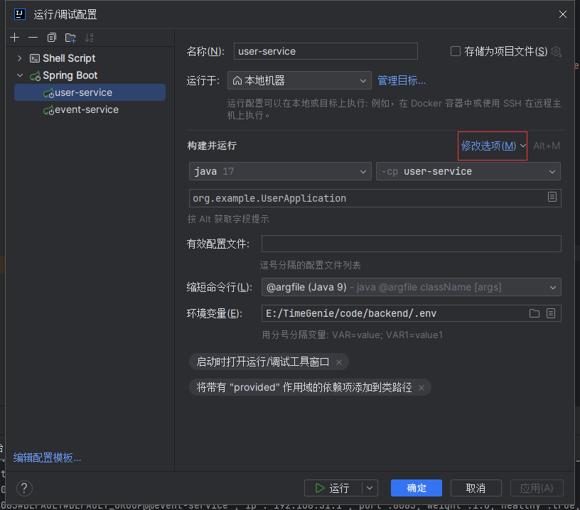

- 我把前端后端所有敏感或者需要动态处理的信息都提取到了环境变量里 并排除了版本管理 大家只需要拉取 main 分支并添加.env 文件即可正常使用 文件见微信群

- 如果需要在自己的电脑上部署测试 请自行修改以下环境变量：
  前端中的 BASEURL 替换为自己主机的 ip 地址
  后端中 DB1 相关配置更改为自己主机上 mysql 数据库的配置
  USER SERVER IP 更换为自己主机的 ip

- 最后 后端运行采用的时临时变量 所以需要点击编辑配置（见下图）
  
  然后点击修改选项 勾选环境变量 选中刚刚添加的后端环境变量文件
  
  注意两个模块都需要编辑一下
