# JMeter性能测试

### 基本使用方法

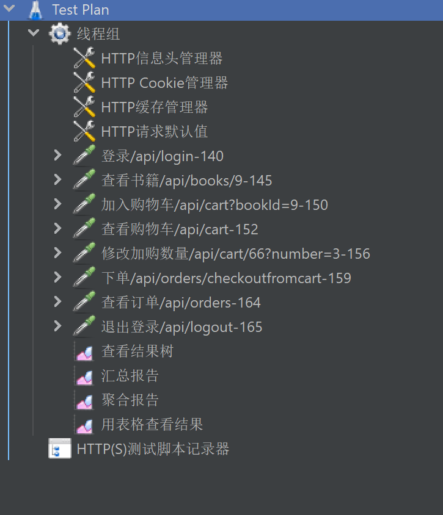

打开后在**Test Plan**中添加**线程组**和**HTTP(S)测试脚本记录器**。（不录制的话只要添加线程组）

**线程组->添加->取样器->HTTP请求** 可添加请求

**线程组->添加->监听器** 中有多种查看结果的形式

#### 录制脚本

##### HTTP(S)测试脚本记录器

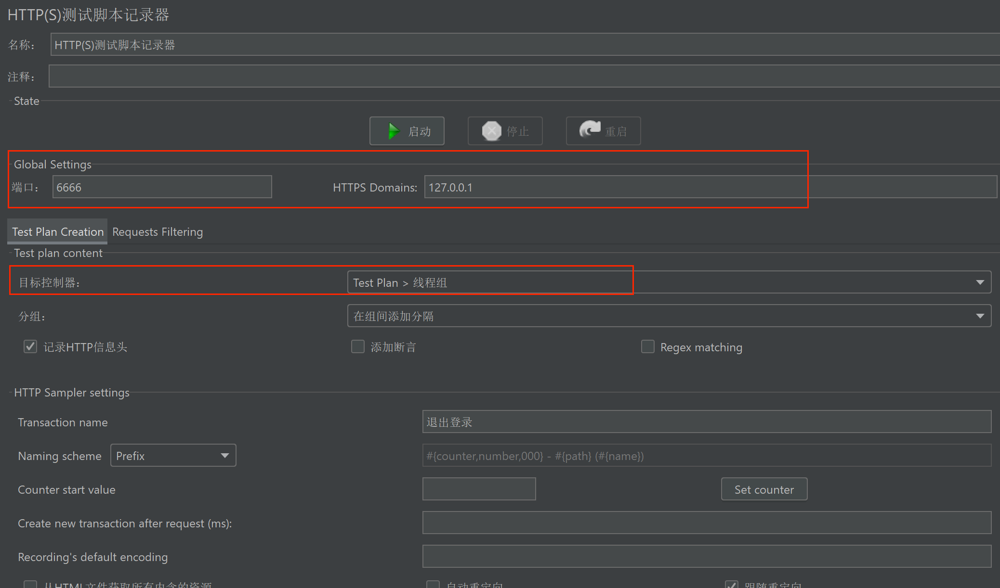

只需要修改框出的两处设置。

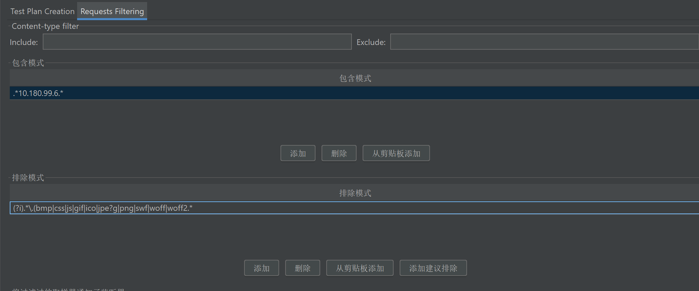

可以在**Requests Filtering**中设置包含模式和排除模式。

包含模式：URL匹配正则表达式，包含此项。

排除模式：添加建议排除即可。

##### 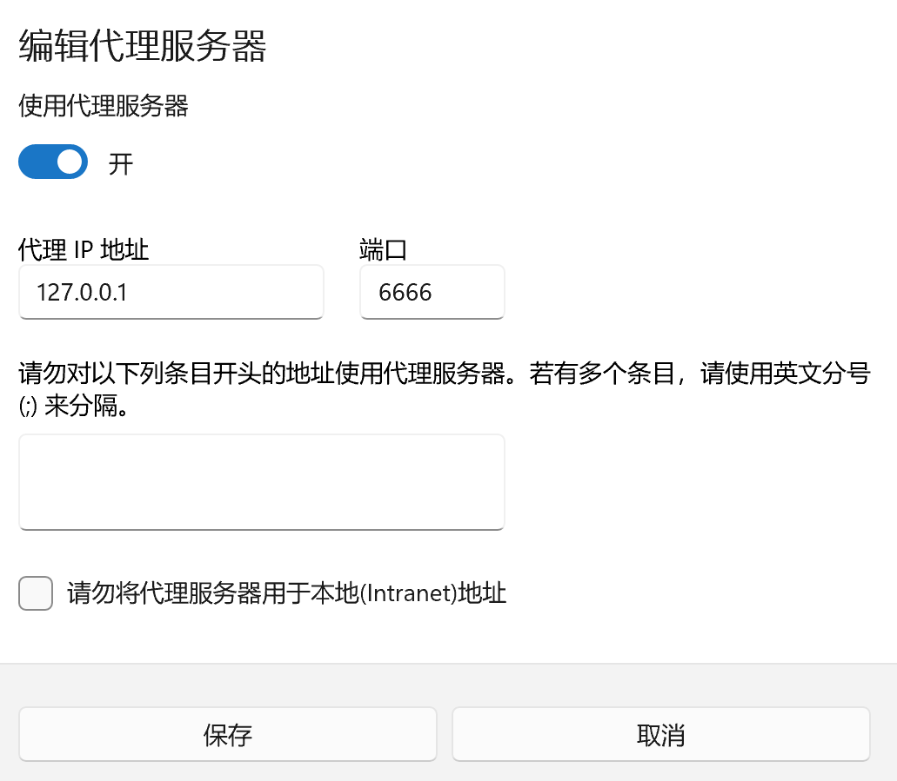

设置本机代理，端口和JMeter中一致。

**注意**

如果要录制本地请求，不能用localhost或127.0.0.1（会录不到），需要用本机IP地址。

即：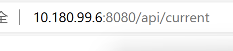

#### 其他

- **线程组**设置中可修改线程数等，如图。

  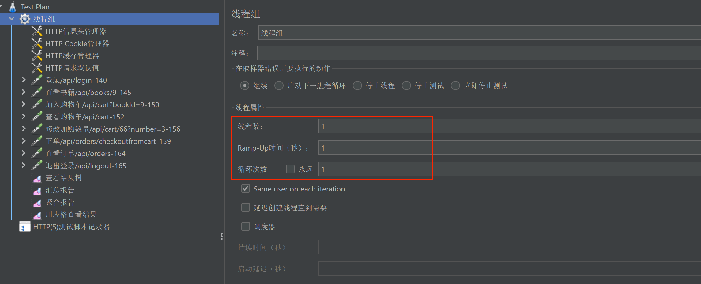

- **线程组->添加->配置元件->HTTP请求默认值**可设置各个请求共有的信息。

- 直接录制后会有比较多多余的请求，留下必要的要进行测试接口即可。
- 可以添加断言。

​	**线程组->添加->断言**

​	例如添加响应断言，要求登录请求的响应数据包含“失败”。

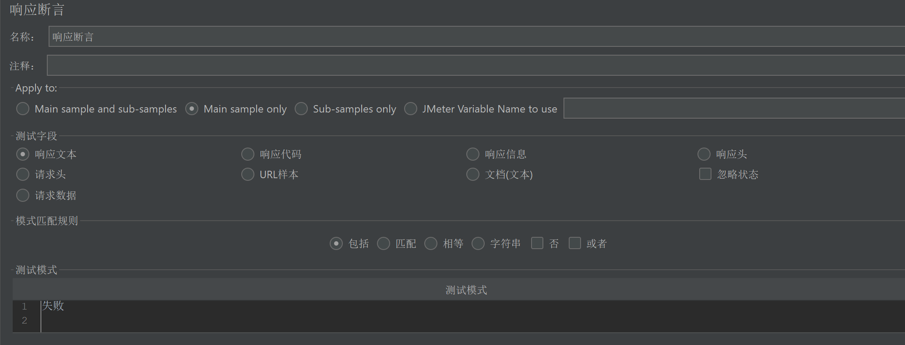

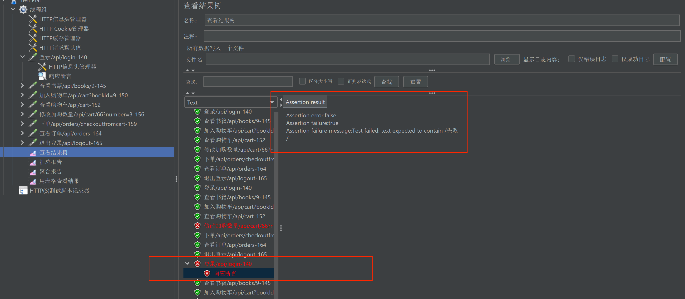

- 请求添加完成后点击启动即可。

### 结果查看

（感觉看**查看结果树**和**聚合报告**就可以）

#### 查看结果树

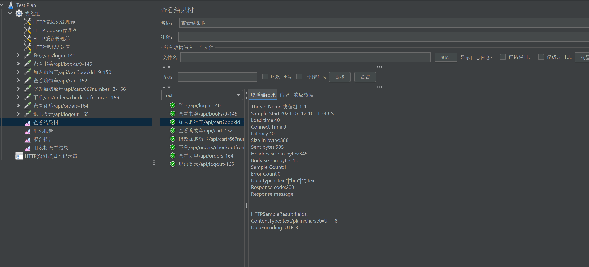

左侧列出各个HTTP请求，并以图标显示是否成功。

右侧可查看取样器结果，请求和响应数据。

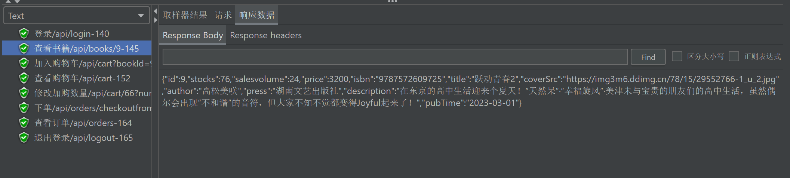

#### 汇总报告

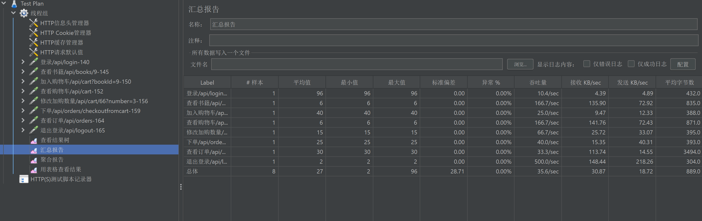

#### 聚合报告

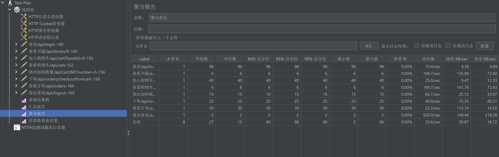

#### 用表格查看结果

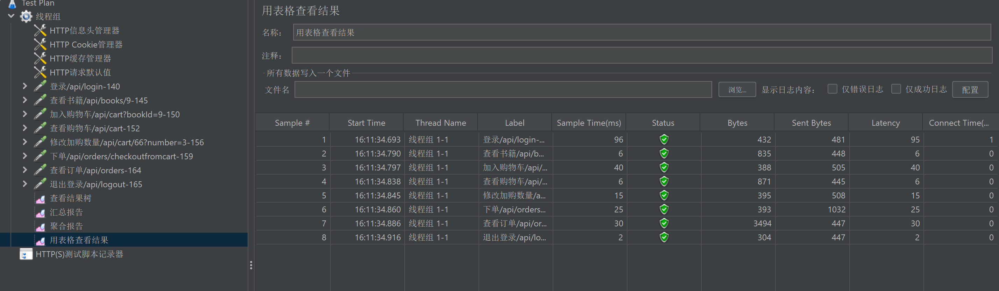

