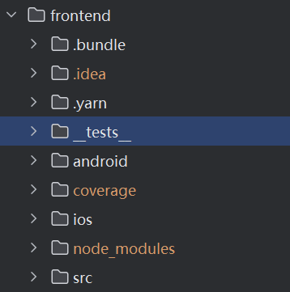
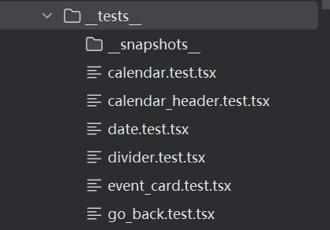
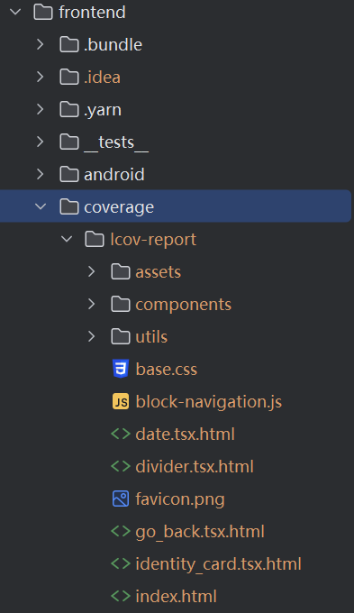

## Jest前端测试

不使用enzyme React版本>16没有对应的enzyme

- [Enzyme is dead. Now what?](https://dev.tohttps://dev.to/wojtekmaj/enzyme-is-dead-now-what-ekl/)
- [Time to say goodbye - Enzyme.js](https://www.piotrstaniow.pl/goodbye-enzyme)

但是由于是react-native自带的测试方法，导致第三方库的组件的测试非常困难。

### 安装依赖

```bash
npm install --save-dev @types/jest
npm install @testing-library/react-native --save-dev
```

### 生成测试
测试文件名：例如，若需要测试的组件为My_button.tsx，则对应的测试文件名为My_button.test.tsx，放在__test__文件下。

一些简单功能的说明来自于官网：

- [@testing-library/react-native - npm](https://www.npmjs.com/package/@testing-library/react-native)
- [Testing Library](https://testing-library.com/docs/react-native-testing-library/setup/)

### 快照测试
用于测试静态UI组件。快照存储序列化后的组件渲染结果。若对组件进行修改，则前后两次快照不同，测试报错。可以使用以下命令更新快照文件：

```bash
npm test -- -u
```
快照文件在__test__/snapshots下。

更多快照测试的内容可以参考官方文档：
- [快照测试·Jest](https://jestjs.io/docs/snapshot-testing)

### 执行测试
执行全部测试，并生成覆盖率报告：
```bash
npx jest --coverage
```

执行针对某一个文件的测试：
```bash
npx jest path/to/the/file --coverage
```
可视化的报告在coverage/lcov-report/utils里面查看，其中index.html为全部的测试报告。


更多关于Jest的内容请参考：
- [Getting Started·Jest](https://jestjs.io/docs/getting-started)