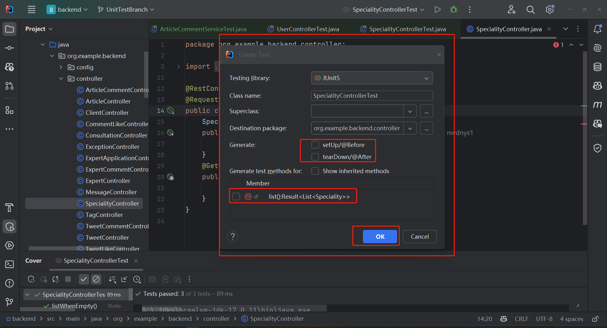
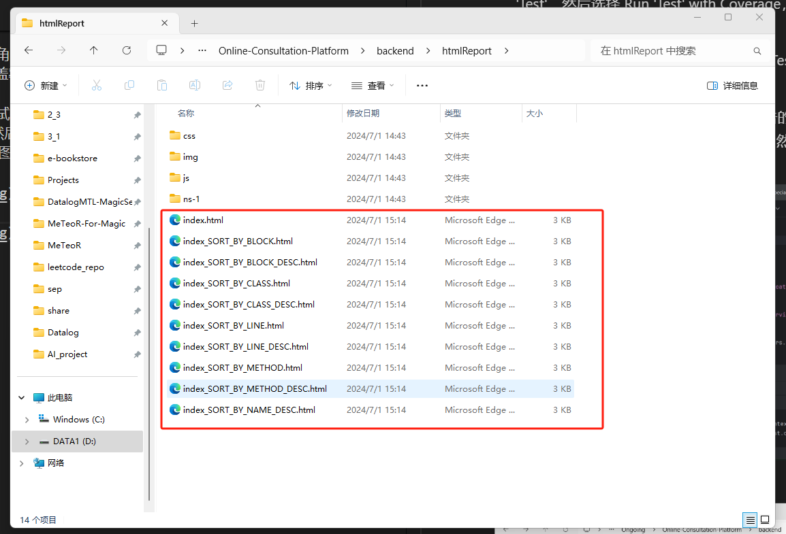

# 单元测试方法

### 7-1 Horizon

总结了一下根据上个学期里面做的简单的单元测试方法、测试代码、以及测试结果的记录。（具体代码和结果可以切换到我们上个学期的项目里的 repo 的 UnitTest 分支中）

通过一个例子 讲一下对最简单的 specialtycontroller 类的测试方法，其中使用到了 mock 方法、对不同情况进行了测试、自动生成了测试代码框架以及自动生成了单元测试报告，达到了类的 100%的测试覆盖率。对于代码的细节、可以询问 gpt 进行理解、因为这个代码当时也是我让 gpt 生成的。

1. 自动生成测试代码的结构：
   右键点击类名，选择 Generate -> Test，然后选择 JUnit5，然后选择要测试的方法，然后点击 OK，就会自动生成测试代码的框架。

- 下面的 setUp 方法是在每个测试方法之前执行的方法，用来初始化一些数据。tearDown 方法是在每个测试方法之后执行的方法。member 中的方法是测试的目标函数。destination 是测试的目标类。

- 下面的这个小框是测试代码即将保存到哪个路径、这里默认是再对应的绿色文件夹的 test 路径下。点击 ok 后就会自动生成测试代码基本框架。

- 生成的测试代码框架基本如下图所示、里面什么都没有 所以需要自己填写测试代码或者让 gpt 辅助生成测试代码。

2. 让 gpt 不同情况下的测试代码如下所示 、这里是对 specialtycontroller 类的测试代码，其中使用了 mock 方法（可以自行去了解一下、或者也要阅读一下这个 help 文档里的两份 pdf），对不同情况进行了同一个函数方法的单元测试。

3. 自动生成单元测试报告以及测试覆盖率的方法：

- 进行测试以及得到测试覆盖率：在测试代码的类名上右键点击，选择 Run 'Test'，然后选择 Run 'Test' with Coverage，然后就会自动生成测试报告以及测试覆盖率。如下图所示：

- 或者点击绿色的三角形按钮，选择 Run 'Test' with Coverage，也可以得到测试报告以及测试覆盖率。

- 自动生成并导出测试报告：点击测试报告的右上角的 Export，然后选择 Export to HTML，然后选择保存的路径，然后点击 OK，就会自动生成测试报告的 html 文件。如下图所示：

- 显示绿色 + 100% 即为全部覆盖。但这只是覆盖的代码行数，不代表测试的质量。所以还需要自己去检查测试代码的质量。

- 我目前只知道这些 所以我抛砖引玉一下、大家可以基于这个基础上、进行进一步的单元测试的学习、然后互相讨论学习一下就行了。
