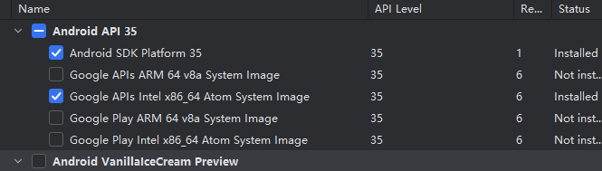
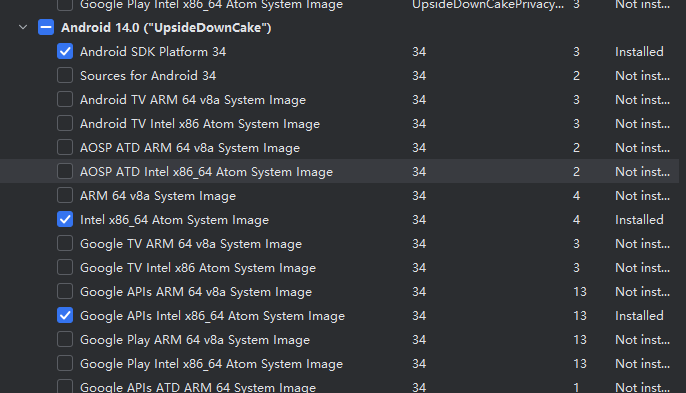
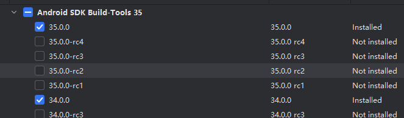
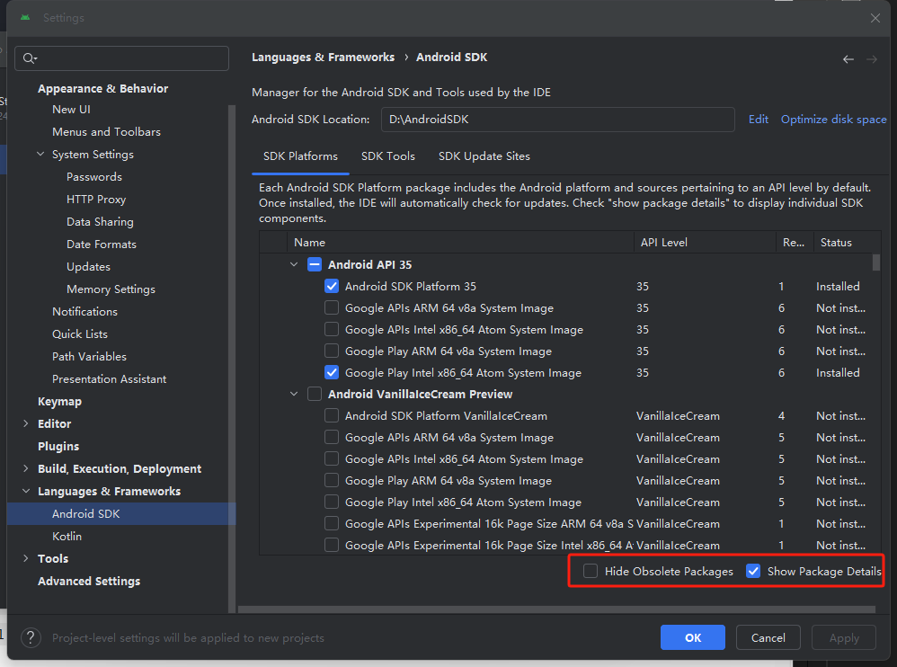
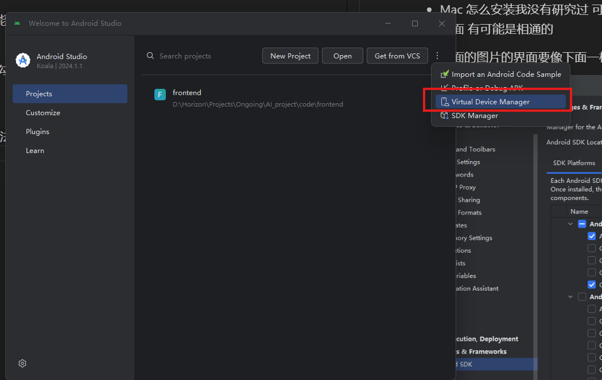
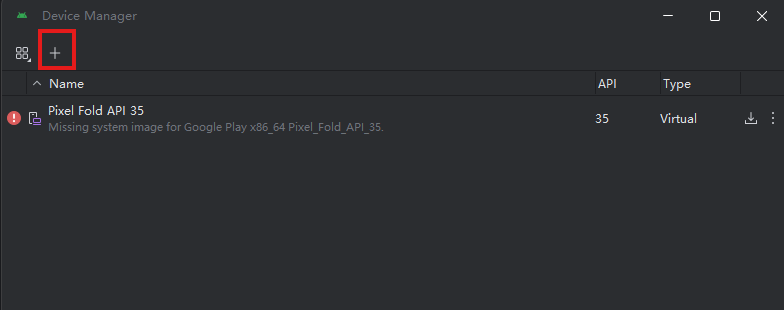
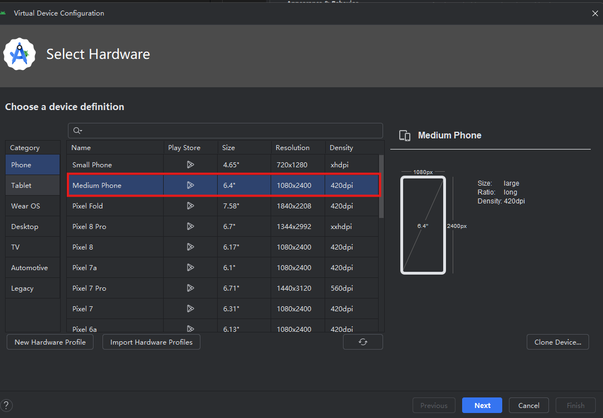
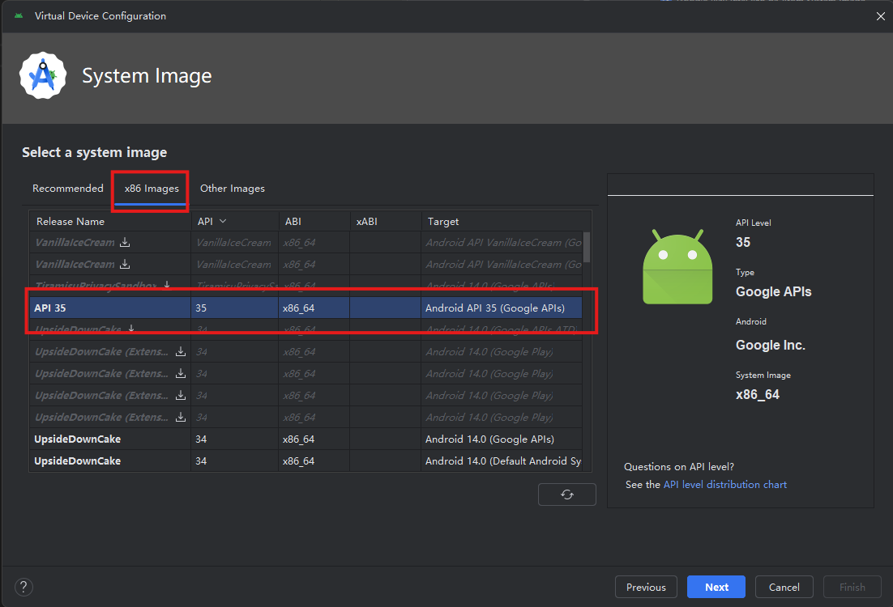
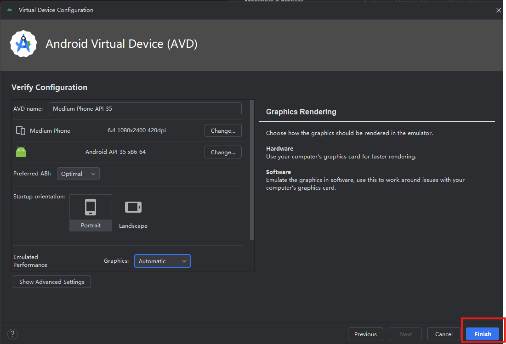
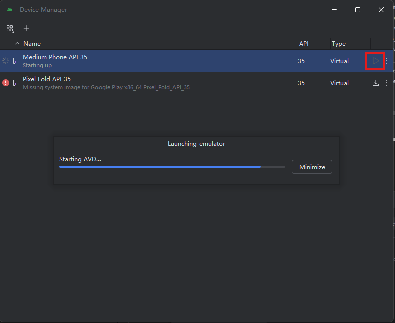

# 如何配置 react native 环境

- 查看文档 跟随指引完成大部分步骤https://reactnative.cn/docs/environment-setup
- 几个踩坑点：
  - 安装 android studio 的 sdk 过程中需要开代理
  - 安装 sdk 步骤中 可以不用和文档里一样安装 api34 的镜像 选择最新的 35 也可以 只要勾选上 SDK Platform 和 Intel X86 Atom64 Image 的镜像即可 不过我不知道两者有什么具体区别
    可以照着我的勾选：

- 添加新的安卓虚拟机 选择 API35 的镜像即可 我也不知道文档说的 tiramisu api33 是哪个镜像

- 如果你和我一样把 android studio 以及它的 sdk 路径放在了其他盘而不是默认路径 那么很有可能你会遇到启动虚拟机失败的情况 请参考这个链接 https://zhuanlan.zhihu.com/p/636061626

- JDK 版本最好换成 17 要更改 jdk 的版本 需要修改环境变量 首先 JAVA_HOME 的环境变量要填写成 jdk17 的安装路径 且最好写在系统变量里 然后系统变量 path 中的 C:/ProgramData/Oracle/Java/javapath 删除 最后把"%JAVA_HOME%\bin"添加到系统变量 path 中 应该就可以了 终端里输入 javac --version 查看 jdk 版本 如果是 17 就可以了 如果需要更换回原来的 jdk 版本 只需要修改 JVA_HOME 这个环境变量指向需要的路径即可

- 启动 react native 最简单的方法：先进入文件夹 npm start 然后按 a 启动安卓应用 第一次会编译很久

- 想要节省系统盘空间的 和我一样在系统变量里创建一个"GRADLE_USER_HOME" 路径填其他盘的文件 这样 gradle 的几个 g 的文件就不会装到默认的 c 盘了 注意系统变量设置完最好重启一下电脑

- Mac 怎么安装我没有研究过 可能需要自己跟着文档试试了 如果遇到某些问题可以参考上面 有可能是相通的

- 上面的图片的界面要像下面一样勾选两个框才是这样的。

- Create Virtual Device...方法如下图所示

- Could not find implementation class 'com.facebook.react.ReactRootProjectPlugin' for plugin 'com.facebook.react.rootproject' specified in jar:file:/D:/Gradle/caches/jars-9/o_ae6c9dca02e4899a527d7b41e90dc058/react-native-gradle-plugin.jar!/META-INF/gradle-plugins/com.facebook.react.rootproject.properties.解决方法：windows 删除 node_modules 的方法:npkill: https://blog.csdn.net/GMLGDJ/article/details/129418280 解决上面报错问题的方法： https://stackoverflow.com/questions/78093982/react-native-android-build-errorcould-not-find-implementation-com-facebook-rea
